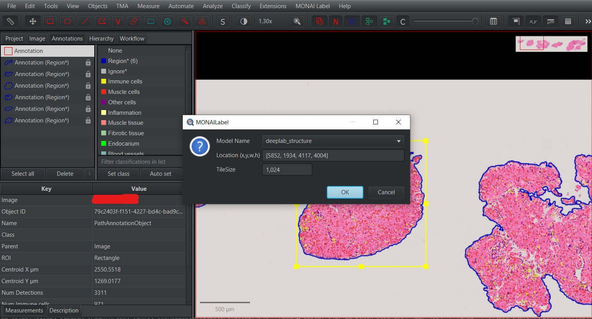

# MONAI Label 

Minimum hardware requirements:
 - 8GB CPU RAM
 - Graphics card supporting CUDA - [list](https://developer.nvidia.com/cuda-gpus)
 - Graphics card with a minimum of 2GB memory


## Installation

All the steps below are necessary to ensure the proper functioning of QuPath together with the MONAI Label extension.

The installation process consists of installing QuPath and installing MONAI Label.
### QuPath

1. Download [QuPath](https://qupath.github.io/) from the official website.
2. After downloading the installer, run the QuPath installation and follow the on-screen instructions.

### MONAI Label

To install MONAI Label along with additional models for higher-level morphological structure segmentation, follow these steps:

1. Install [Python](https://www.python.org/downloads/) version >= 3.9.
2. Add the path to Python to the environment variables. The path to Python added to the environment variables should look similar to the following:
`C:\Users\{user}\AppData\Local\Programs\Python\{python}`, where `{user}` is replaced with the user identifier within the OS and {python} represents the directory name with the installed Python for a specific version.
3. Download the development branch from the [repository](https://github.com/ivanvykopal/MONAILabel/tree/development) stiahnuť vetvu development.
  - First method via `Code` > `Download ZIP`
  - Second method:
    ```git
    git clone https://github.com/ivanvykopal/MONAILabel.git
    git fetch --all
    git checkout development
    ```
4. To download the weights of the models and the sample QuPath project, it is necessary to contact the [Vision & Graphics Group (VGG)](https://vgg.fiit.stuba.sk/team/) research group at FIIT STU, which manages the weights of the models and the sample project.
5. Create a Python environment within the downloaded source code:
   - Using the `venv` command:
      ```bash
      virtualenv ".venv/monailabel" -p python3.9.16
      ```
    - Using `conda`
      ```bash
      conda create -n "monailabel" python=3.9.16
      ```
     It is recommended to use [Anaconda](https://www.anaconda.com/products/distribution) or [Miniconda](https://docs.conda.io/en/latest/miniconda.html) for managing multiple environments.
6. Install the packages from `requirements.txt`
    - `venv`
      ```bash
      .venv/monailabel/Scripts/activate
      python -m pip install --upgrade pip
      pip install -r requirements.txt
      ```
    - `conda`
      ```bash
      conda activate monailabel
      python -m pip install --upgrade pip
      pip install -r requirements.txt
      ```
7. Download and install [Cuda Toolkit 11.2](https://developer.nvidia.com/cuda-11.2.0-download-archive). Follow the installation steps.
8. After installing the Cuda Toolkit, restart your computer for proper configuration and Cuda settings.
9. Download [openslide binaries](https://openslide.org/download/) and extract them to any location. After extraction, add the path to the `bin` directory to the environment variables in `PATH`.
10. To add the path to the `monailabel\scripts` directory to the `PATH` environment variable, follow the instructions in this [macOS example](https://www.cyberciti.biz/faq/appleosx-bash-unix-change-set-path-environment-variable/). If any `dll` libraries are missing, you can download them from [dll-files.com](https://www.dll-files.com/). Specifically, if you need the missing `cudnn64_8.dll`, you can download it using this link. After downloading the `dll` files, you need to copy them to the system disk. On Windows systems, the standard location is `C:\Windows\System32`.
11. Download the latest MONAI Label extension for QuPath from the [repository](https://github.com/ivanvykopal/MONAILabel/tags). The latest extension can be found in the latest `Release` as `qupath-extension-monailabel-{version}.jar`, where `version` is the identifier of the latest version, for example, `0.3.1.2`.
12. To add the MONAI Label extension, run QuPath and drag the downloaded file `qupath-extension-monailabel-{version}.jar` into the QuPath area and confirm the dialog window. This will install the MONAI Label extension in QuPath.
13. Add the downloaded weights for `pathology_structure_segmentation_nestedunet` to `apps/pathology/model/pathology_structure_segmentation_nestedunet/models` and add the weights for `pathology_structure_segmentation_deeplabv3plus` to `apps/pathology/model/pathology_structure_segmentation_deeplabv3plus/models`.
14. After launching QuPath, go to `Edit` > `Preferences...` > `MONAI Label` and change the Server URL to `http://0.0.0.0:8000`.

## Running the Server

The preferred way to run the server is using docker:

```bash
docker build -t monailabel .

docker run --gpus all --rm -ti -p 8000:8000 monailabel bash
```

or you can use the following command

```bash
docker compose up
```

The second way to start the server is by using the provided script `start_server.bat`, which can be run with the following command:

```bash
start_server
```

If the server does not start, manual startup is required using the following commands.

Before starting the server, activate the Python environment:
 - `venv`
 ```bash
 .venv/monailabel/Scripts/activate
 ```
 - `conda`
 ```bash
 conda activate monailabel
 ```

To start the server:
```bash
monailabel start_server --app apps/pathology --studies datasets/
```
## Segmentation in QuPath

To perform the segmentation of higher-order morphological structures, import WSI (Whole Slide Imaging) images into the QuPath project downloaded during installation.

1. Create annotations for tissue and cells along with their classifications. For this step, you can use the downloaded script.

    To use the downloaded script, `Tissue detection and cell detection.groovy`, open it in the panel `Automate` > `Show script editor`. Once the `Script editor` is open, select `File` > `Open...` and choose the directory where the downloaded scripts are located. Select the script `Tissue detection and cell detection.groovy.` After loading the script, choose the option `Run` to perform tissue and cell segmentation and cell classification.

2. Select the area of the image for which you want to perform prediction.

    

3. Choose `MONAI Label` > `Annotations...` and then select the model you want to use for prediction in the `Model Name` section.

    The currently available models are:
    - `deeplab_structure` - DeepLabV3+ for predicting vessels, inflammation, and endocardium in H&E images
    - `nestedunet_structure` - U-Net++ for predicting vessels, inflammation, and endocardium in H&E images

    Press `OK` after selecting the model.

    

4. After the prediction is completed, the results are available in QuPath, where you can edit, delete, or manually add missing annotations.

    

To select annotations for deletion, enable `Selection mode` by choosing `S` in the panel. Once `Selection mode` is enabled, you can use various selection methods, such as rectangular selection or brush selection. To cancel `Selection mode`, click `S` again.


